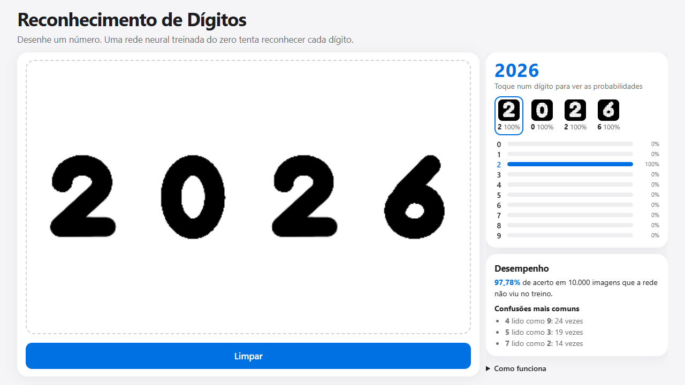

# Reconhecimento de Dígitos

Desenhe um número e uma rede neural tenta reconhecer cada dígito. A rede foi escrita e treinada do zero em Python só com NumPy, no conjunto MNIST, e roda direto no navegador.

**Acesse:** https://gutemberg-vercosa.github.io/reconhecimento-digitos/

<a href="https://gutemberg-vercosa.github.io/reconhecimento-digitos/"></a>

## O que ele faz

- Reconhece números de um ou mais dígitos enquanto você desenha, com mouse, dedo ou caneta.
- Mostra, para cada dígito, a imagem 28x28 que a rede realmente recebe e a probabilidade de cada um dos 10 dígitos.
- Mostra a acurácia no conjunto de teste e as confusões mais comuns da rede.
- Funciona no celular, com tema claro e escuro automático, e nada é enviado para servidor.

## Resultado

**97,78% de acerto** nas 10 mil imagens de teste do MNIST, que a rede não viu no treino. As confusões mais comuns são 4 lido como 9, 5 lido como 3 e 7 lido como 2.

## Como funciona

**Treino (Python + NumPy)**

- Rede de duas camadas: 784 entradas (uma por pixel), 128 neurônios ocultos com ReLU e 10 saídas com softmax.
- Propagação, retropropagação dos gradientes e otimizador Adam escritos à mão, sem bibliotecas de aprendizado de máquina.
- 20 épocas sobre as 60 mil imagens de treino, em lotes de 128. Cada lote é deslocado até 2 pixels, para a rede tolerar dígitos fora do centro.
- Os pesos vão para `public/modelo.bin` (float32, cerca de 400 KB) e as métricas para `public/metricas.json`.

**Site (TypeScript)**

- O desenho é separado em dígitos pelos grupos de traços que não se tocam (componentes conectados), em ordem da esquerda para a direita. Traços soltos na mesma coluna, como o corte de um 5, contam como um dígito só; dígitos encostados são lidos como um.
- Cada dígito é recortado, reduzido para caber em 20x20 e centralizado pelo centro de massa numa imagem 28x28, o mesmo preparo das imagens do MNIST.
- A rede é recalculada em TypeScript a partir dos pesos exportados.

**Testes**

- Em Python, os gradientes calculados à mão são conferidos contra diferenças finitas.
- Em TypeScript, a inferência é conferida contra as probabilidades calculadas pelo Python para as mesmas imagens, e o preparo do desenho tem testes próprios.

## Tecnologias

- Python e NumPy para o treino.
- TypeScript e Vite, sem frameworks, para o site.
- Vitest e unittest para os testes.
- GitHub Actions roda os testes das duas partes, gera o build e publica no GitHub Pages a cada push.

## Estrutura

| Arquivo | Responsabilidade |
|---|---|
| `treino/rede.py` | Rede, gradientes e otimizador Adam |
| `treino/treinar.py` | Baixa o MNIST, treina e exporta pesos, métricas e amostras de conferência |
| `src/rede.ts` | Lê os pesos e calcula as probabilidades |
| `src/preparo.ts` | Separa o desenho em dígitos e converte cada um para o formato do MNIST |
| `src/main.ts` | Interface: desenho, resultado e métricas |

## Rodando localmente

```bash
pip install numpy
python treino/treinar.py   # treina de novo e regrava os pesos (opcional)

npm install
npm run dev    # servidor de desenvolvimento
npm test       # testes
npm run build  # build de produção em dist/
```
